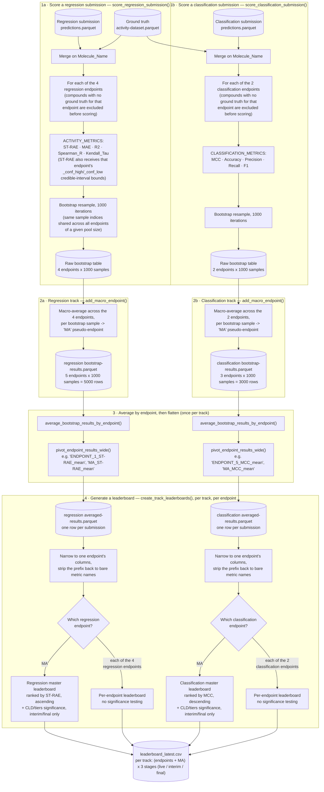

# Regression/Classification Scoring & Leaderboard Generation

How a regression or classification submission turns into bootstrapped per-endpoint
metrics, a macro-averaged "MA" score, and its own leaderboard shown on the
HuggingFace Space. Scope: regression and classification are two fully independent
tracks — separate S3 upload prefix, separate Lambda, separate validation, separate
scoring call — each mirroring how the structure track is already independent.

<!-- TODO: the endpoint counts below (4 regression, 2 classification) and the
     example endpoint names (ENDPOINT_1 …) assume the template's default config.
     Update them to match this challenge's REGRESSION_ENDPOINTS /
     CLASSIFICATION_ENDPOINTS in backend/config.py. -->
 They still score against the same shared ground-truth
dataset (the same compound set, just different columns) via `ACTIVITY_PATHS`.
The structure track itself scores a single endpoint (`LDDT-PLI`/`BiSyRMSD`/`LDDT-LP`)
and skips the macro-averaging step entirely (stage 2 below), so it goes straight from
stage 1 into stage 3's pivot (still narrowed to its one endpoint, "Structure") with no
per-endpoint loop, and `create_track_leaderboards` (stage 4) builds it exactly one
leaderboard instead of one per endpoint. See
[structure-scoring.md](structure-scoring.md) for how structure's stage 1 actually
works. See [phases-and-stages.md](phases-and-stages.md) for how the
"live"/"interim"/"final" stage referenced here relates to the separate compound-set
"phase" concept and the HF Space's `CURRENT_PHASE`.

## Key design points

- **Submission upload, scoring, and leaderboards are all three independent tracks.**
  Regression and classification each have their own S3 upload prefix
  (`REGRESSION_PATHS`/`CLASSIFICATION_PATHS`, `submissions/regression/...` /
  `submissions/classification/...`), own Lambda
  (`lambda_handler_regression.py`/`lambda_handler_classification.py`), and own
  validation schema (`submission_validation.get_regression_schema`/
  `get_classification_schema`) — mirroring the already-independent structure track.
  Both still score against the same shared ground truth (`ACTIVITY_PATHS`,
  `activity-dataset.parquet`/`activity-identifiers.parquet`) since they cover the same
  underlying compound set, just different columns. One valid submission produces
  exactly one manifest row, under its own track.
- **Regression and classification endpoints use different metric sets, dispatched per
  endpoint.** `score_activity_predictions(predictions, ground_truth, endpoints)` is
  called once per track with that track's own `endpoints` list (so bootstrap sample
  indices are shared across endpoints wherever pool sizes match — see below), and
  picks `ACTIVITY_METRICS` (ST-RAE/MAE/R2/Spearman_R/Kendall_Tau) for a regression
  endpoint or `CLASSIFICATION_METRICS` (MCC/Accuracy/Precision/Recall/F1) for a
  classification endpoint via `_metrics_for_endpoint`.
- **`ST-RAE` (soft-thresholded RAE) needs each regression endpoint's credible-interval
  bounds.** Ground truth carries `f"{endpoint}{REGRESSION_CREDIBLE_INTERVALS_UPPER_SUFFIX}"`/
  `f"{endpoint}{REGRESSION_CREDIBLE_INTERVALS_LOWER_SUFFIX}"` columns (`..._conf_high`/
  `..._conf_low`) for every regression endpoint. `score_activity_predictions` pulls
  these alongside `y_true`/`y_pred` and passes them to `bootstrap_metrics`, which
  inspects each metric function's signature (`_metric_needs_credible_interval_bounds`)
  and only forwards the bounds to metrics that accept them — currently just `ST-RAE`.
  A prediction inside `[y_true_lower, y_true_upper]` scores zero error for that
  compound; outside the band, error is the distance to the nearest bound rather than
  to the raw point estimate. Classification endpoints have no such columns — `None` is
  passed through, which is harmless since no `CLASSIFICATION_METRICS` function needs
  them.
- **`add_macro_endpoint` appends the macro step.** It appends that track's own "MA"
  pseudo-endpoint via `compute_macro_bootstrap_results` when the track has more than
  one endpoint. Called once per track's own `score_activity_predictions` output.
- **Classification labels can be missing; predictions never can be.** A compound
  without a ground-truth label for an endpoint (regression or classification) is
  excluded from that endpoint's bootstrap sampling — the exclusion mask uses
  `pd.isna` (not `np.isnan`) so it works whether the ground-truth column ends up
  float, bool, or (once a NaN forces upcasting) object dtype after the merge. A
  missing *prediction* for a compound that does have ground truth is a hard error,
  not silently excluded — `submission_validation.get_regression_schema`/
  `get_classification_schema`'s `nullable=False` should already reject that at validation time, but
  `score_activity_predictions` raises `ValueError` too as a second line of defence.
- **Bootstrap indices are shared across endpoints wherever their pool sizes match.**
  `bootstrap_sampling()` is cached by `(dataset_size, n_samples)`, so every endpoint
  with the same number of ground-truth-eligible compounds reuses the exact same 1000
  resamples for a given submission — this is what makes it valid to combine those
  endpoints sample-by-sample when macro-averaging.
- **The "MA" pseudo-endpoint is not a real endpoint** — it's a derived row computed
  *within* each bootstrap sample from that track's other endpoints, then appended so
  the rest of the pipeline (stage 3 onward) can treat it identically to a real
  endpoint.
- **Every metric uses a plain arithmetic mean across endpoints**, including the two
  bounded correlation coefficients (`Spearman_R`, `Kendall_Tau`).
  `Spearman_R` previously used a Fisher z-transform (`arctanh` → mean(z) → `tanh`) —
  the standard variance-stabilising treatment for combining several noisy *estimates
  of the same underlying correlation* (e.g. meta-analysis, or one endpoint's Spearman
  averaged across repeated resamples of the same data). Macro-averaging here instead
  combines Spearman scores from *different* endpoints — unrelated true correlations,
  not repeated estimates of one — so that justification
  doesn't hold. Worse, `arctanh` blows up near ±1 (`arctanh(1 - 1e-7) ≈ 8.4` vs.
  `arctanh(0) = 0`), so a submission with a near-perfect Spearman on just one or two
  endpoints and ~0 on the rest could macro-average to ~0.99 instead of the
  naively-expected ~0.3 — a couple of easy/lucky endpoints dominating the whole score
  rather than it reflecting balanced performance across the panel. `Kendall_Tau` was
  never a candidate for this transform in the first place: Fisher's z is derived for
  Pearson's r (and commonly extended to Spearman's rho), but that derivation doesn't
  carry over to Kendall's tau, which has a different asymptotic sampling distribution.
- **Endpoint-prefixed, then narrowed back down.** Each track's `averaged-results.parquet`
  stores *every one of that track's* endpoint stats in one wide row (e.g.
  `ENDPOINT_1_ST-RAE_mean`, `MA_ST-RAE_mean` for regression;
  `ENDPOINT_5_MCC_mean`, `MA_MCC_mean` for classification). Generating any one
  leaderboard narrows this back down to a single endpoint's bare columns
  (`ST-RAE_mean`, `MCC_mean`, …) — so the exact same `FinalLeaderboard` ranking/CLD
  code handles every track's master and per-endpoint leaderboards identically; only
  which columns get selected differs.
- **Every real endpoint gets its own leaderboard**, ranked on that endpoint's own
  metrics. Each track's master (`MA`) leaderboard is the only
  one in that track ranked on the macro-averaged score — regression's master ranks by
  `ST-RAE` (ascending, lower is better), classification's by `MCC` (descending, higher
  is better).
- **Significance testing and invalid-submission filtering apply only to each track's
  master leaderboard (or the track's one leaderboard, for a single-endpoint track like
  structure), and only for "interim"/"final" stages — never "live", and never the
  individual per-endpoint leaderboards of a multi-endpoint track.** Pairwise bootstrap
  comparisons are expensive, so this keeps the auto-generated live leaderboard cheap;
  see `create_track_leaderboards` in `backend/aws_leaderboards.py`.
- **Leaderboard generation is one function regardless of track or endpoint count.**
  `create_track_leaderboards` builds one leaderboard per `TrackPaths.endpoints` entry,
  plus an additional `MA` master when there's more than one endpoint (a
  single-endpoint track like structure just gets that one leaderboard, which also
  doubles as the "master" for significance-testing purposes). A track with *zero*
  endpoints (`CLASSIFICATION_ENDPOINTS = []`, e.g. before that track launches, or if
  it's ever pulled) returns `{}` immediately rather than attempting to build anything
  — `lambda_handler_leaderboard.py`'s `_TRACKS` dict also skips registering a
  zero-endpoint track in the first place, so this is belt-and-suspenders.

## Where this lives in the code

| Diagram stage | Function | File |
|---|---|---|
| 1. Bootstrap + raw metrics, per-endpoint metric dispatch | `score_activity_predictions`, `bootstrap_metrics`, `_metrics_for_endpoint`, `_metric_needs_credible_interval_bounds` | `backend/evaluate_predictions.py` |
| 2. Narrow to one track + macro-average across its endpoints | `add_macro_endpoint`, `compute_macro_bootstrap_results` | `backend/evaluate_predictions.py` |
| 3. Average by endpoint + flatten (once per track) | `average_bootstrap_results_by_endpoint`, `pivot_endpoint_results_wide` | `backend/evaluate_predictions.py` |
| Per-track pipeline: fetch, validate, score, save, manifest | `process_new_regression_submission`, `process_new_classification_submission`, `score_regression_submission`, `score_classification_submission` | `backend/aws_submission_processing.py` |
| 4. Narrow to one endpoint + rank | `create_track_leaderboards`, `_narrow_averaged_results_to_endpoint` | `backend/aws_leaderboards.py` |
| Ranking, CLD significance | `FinalLeaderboard`, `EntryComparison` | `backend/leaderboard.py` |
