# Structure Track Scoring

How a structure submission (a zip of predicted protein–ligand complex PDBs) turns into
per-compound pose-quality scores, bootstrapped uncertainty, and the structure
leaderboard. Companion to [scoring-and-leaderboards.md](scoring-and-leaderboards.md),
which covers the regression and classification (activity) tracks and the parts of the
pipeline (bootstrap resampling, endpoint-prefixed flattening, leaderboard generation)
shared by every track — this doc only covers what's specific to structure:
`score_single_structure` through `bootstrap_structure_metrics` in
`backend/evaluate_predictions.py`.

```mermaid
flowchart TD
    subgraph S0["0 · Submission format"]
        ZIP[("structures.zip<br/>STRUCTURE_DATASET_SIZE PDB files, one per compound<br/>ligand residue must be named LIG")]
    end

    subgraph S1["1 · Per-compound scoring — score_single_structure(), one call per compound"]
        ZIP --> LOAD["Load model + reference PDB via OST PDBPrep<br/>(fault_tolerant=True)"]
        LOAD --> SELECT["Select LIG heavy atoms<br/>(rname=LIG and ele!=H)"]
        SELECT --> COUNT{"&gt;2 LIG residues<br/>in model?"}
        COUNT -->|yes| NAN1["NaN sentinel<br/>(all 3 metrics)"]
        COUNT -->|no| SCORERS["Run two independent OST scorers<br/>SCRMSDScorer -&gt; BiSyRMSD, LDDT-LP<br/>LDDTPLIScorer -&gt; LDDT-PLI<br/>(substructure_match=True, coverage_delta=0.1)"]
        SCORERS --> RECONCILE["Reconcile each scorer's independently-solved<br/>ligand assignment via 'chain.residue_number' keys<br/>(their integer indices aren't comparable)"]
        RECONCILE --> PAIRS{"Any LDDT-PLI pair<br/>found in SCRMSD's keys?"}
        PAIRS -->|no| NAN1
        PAIRS -->|yes| STATE{"SCRMSD state_matrix<br/>valid for that pair?"}
        STATE -->|no| PARTIAL["Record LDDT-PLI only<br/>BiSyRMSD, LDDT-LP -&gt; NaN"]
        STATE -->|yes| FULL["Record all 3 scores"]
        PARTIAL --> BEST
        FULL --> BEST["Pick best pair:<br/>sort by (-LDDT-PLI, BiSyRMSD), take first"]
    end

    subgraph S2["2 · Per-submission aggregation — score_structure_predictions()"]
        BEST --> PERCOMPOUND["One row per compound<br/>skip if no matching ground truth"]
        PERCOMPOUND --> COVERAGE["coverage = 1.0 if LDDT-PLI not NaN else 0.0<br/>(recorded before filling)"]
        COVERAGE --> PENALTY["Fill NaN with worst-case penalties:<br/>LDDT-PLI, LDDT-LP -&gt; 0.0<br/>BiSyRMSD -&gt; BISYRMSD_NAN_PENALTY (20 Å)"]
        PENALTY --> PERCOMPOUNDDF[("per-compound-results.parquet<br/>one row per compound x (LDDT-PLI, BiSyRMSD, LDDT-LP, coverage)")]
    end

    subgraph S3["3 · Bootstrap aggregation — bootstrap_structure_metrics()"]
        PERCOMPOUNDDF --> RESAMPLE["Resample compounds (rows) with replacement<br/>1000 iterations"]
        RESAMPLE --> MEAN["Per sample: plain mean of each metric<br/>across the resampled compounds<br/>(not a regression metric function, unlike activity)"]
        MEAN --> BOOTDF[("bootstrap-results.parquet<br/>1000 rows, Endpoint='Structure' always<br/>same Sample/Endpoint schema as activity")]
    end

    BOOTDF --> BYEP["average_bootstrap_results_by_endpoint()<br/>mean &amp; std over the 1000 samples<br/>(shared helper, reused from activity)"]
    PERCOMPOUNDDF --> COVMEAN["coverage_mean = per-compound coverage.mean()<br/>added directly — coverage is scalar,<br/>not bootstrapped"]
    BYEP --> PIVOT["pivot_endpoint_results_wide()<br/>one wide row, prefixed 'Structure_...'<br/>(shared helper, reused from activity)"]
    COVMEAN --> PIVOT
    PIVOT --> WIDESAVE[("averaged-results.parquet")]

    WIDESAVE --> LB["create_track_leaderboards()<br/>one leaderboard, ranked by LDDT-PLI descending<br/>(no macro-average — only one endpoint, 'Structure')"]
```

## Submission-level QA (not per-compound scoring — `process_new_structure_submission`)

After scoring phase 0 (all compounds), the coverage column is used to classify the
whole submission:

- **All compounds failed** (`coverage == 0` everywhere) → the submission is marked
  invalid outright (`"Scoring failed for all structures, please check submission"`),
  scoring is aborted for both phases.
- **Some compounds failed** → `validation_result.scoring = "partial"`, and the failed
  `Molecule_Name`s are recorded — the submission still gets a leaderboard entry (the
  failed compounds contribute their worst-case-penalty scores, per above), just with a
  partial-scoring flag surfaced to the participant.
- **No failures** → `validation_result.scoring = "complete"`.

## Key design points

- **Two OST scorers, reconciled post-hoc.** `SCRMSDScorer` (BiSyRMSD, LDDT-LP — pose
  RMSD / local-contact metrics) and `LDDTPLIScorer` (LDDT-PLI — protein-ligand
  interaction accuracy) each solve their own chain-mapping and ligand-assignment
  problem independently; that's an OST library constraint, not a choice made in this
  repo. When a complex has multiple equivalent ligand copies, the two scorers'
  internal integer indices are not guaranteed to refer to the same physical ligand, so
  `score_single_structure` builds a stable `"{chain}.{residue_number}"` key for each
  ligand and joins the two scorers' results on that instead. LDDT-PLI's assignment is
  treated as the source of truth for *which* pairs to report; a pair present in
  LDDT-PLI's assignment but missing from SCRMSD's ligand list is skipped (logged, not
  scored) — see the `RECONCILE`/`PAIRS` steps in the diagram.
- **A failed match doesn't drop the compound.** Even when a compound can't be scored
  at all (bad PDB, no ligand match, LDDT-PLI ↔ SCRMSD assignment mismatch,
  >2 LIG residues), it still gets a row with worst-case penalty values
  (`LDDT-PLI`/`LDDT-LP = 0.0`, `BiSyRMSD = BISYRMSD_NAN_PENALTY`), not an exclusion —
  the same principle activity scoring follows for a metric that fails on a bootstrap
  sample: a real failure should read as a bad score, not silently vanish from the
  average. `coverage` is recorded before this fill so the failure rate itself is still
  visible on the leaderboard/CSV.
- **Bootstrapping is a plain per-compound resample-and-mean**, not per-sample metric
  functions like activity's `bootstrap_metrics` — there's no y_true/y_pred pair to feed
  a metric function; `score_single_structure` has already reduced each compound down
  to three scalar scores, so the bootstrap just resamples *which compounds* go into
  each sample's mean.
- **Coverage is scalar, not bootstrapped.** It's a property of the whole submission
  (fraction of compounds successfully matched), not a distributional quantity per
  bootstrap sample, so it's computed once and appended directly to `averaged_df`
  (`coverage_mean`) rather than flowing through the bootstrap table.
- **`Endpoint = "Structure"` is a fixed constant**, not derived from `config.py`'s
  endpoint list the way activity's endpoints are — it lets
  `average_bootstrap_results_by_endpoint`/`pivot_endpoint_results_wide` (built for
  activity's per-endpoint schema) work unchanged for structure's single endpoint. There
  is no macro-average pseudo-endpoint for structure (see
  [scoring-and-leaderboards.md](scoring-and-leaderboards.md) — a single-endpoint track
  never gets one), and `STRUCTURE_ENDPOINTS = ["Structure"]` is also the leaderboard's
  one and only endpoint slug.
- **Ranked by `LDDT-PLI` descending** (`SORT_STRUCTURE_LEADERBOARD_BY = "LDDT-PLI"`,
  `metric_sort_ascending=False`) — higher is better, like classification's `MCC` but
  unlike regression's `ST-RAE` (lower is better, ascending).
- **`dummy_score_single_structure`** (random scores, no OST dependency) exists in
  `evaluate_predictions.py` but is **not currently called anywhere** —
  `score_structure_predictions` always calls the real `score_single_structure`. Real
  OST scoring is imported lazily inside `score_single_structure`'s `try` block (not at
  module load time), so importing `evaluate_predictions` doesn't require OST to be
  installed — only actually scoring a structure does.
- **Deeper structural QA isn't implemented.** The ligand residue naming convention
  (`LIG`) that `score_single_structure` relies on is never validated at submission
  time (see `backend/README.md`'s Structure submissions note) — a wrongly-named
  residue silently becomes a `coverage=0` / worst-case-penalty row here rather than a
  validation error at upload time.

## Where this lives in the code

| Diagram stage | Function | File |
|---|---|---|
| 1. Per-compound scoring | `score_single_structure` | `backend/evaluate_predictions.py` |
| 2. Per-submission aggregation | `score_structure_predictions` | `backend/evaluate_predictions.py` |
| 3. Bootstrap aggregation | `bootstrap_structure_metrics` | `backend/evaluate_predictions.py` |
| Phase filtering, S3 orchestration, submission-level QA | `score_structure_submission`, `process_new_structure_submission` | `backend/aws_submission_processing.py` |
| Zip extraction (submission + ground truth) | `fetch_structure_submission_data`, `load_structure_ground_truth`, `_extract_pdb_files` | `backend/aws_submission_processing.py` |
| Submission-time validation (file count, `.zip` suffix) | `validate_structure_submission` | `backend/submission_validation.py` |
| Leaderboard generation | `create_track_leaderboards` | `backend/aws_leaderboards.py` |
